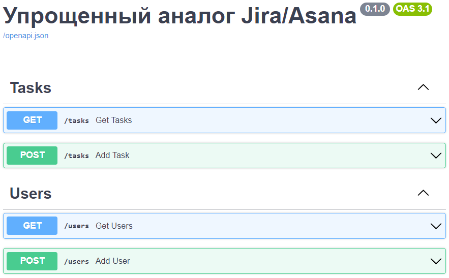

## Запуск приложения
1. Создать виртуальное окружение и установить зависимости
2. Вызвать в терминале `python3 src/main.py`

### Настройка Alembic для асинхронного драйвера
1. Находясь в корневой директории, запустить  
`alembic init -t async migrations`
2. Перенести папку `migrations` внутрь папки `src`.
3. Заменить `prepend_sys_path` на `. src` и `script_location` на `src/migrations` внутри `alembic.ini`

### Документация к API
